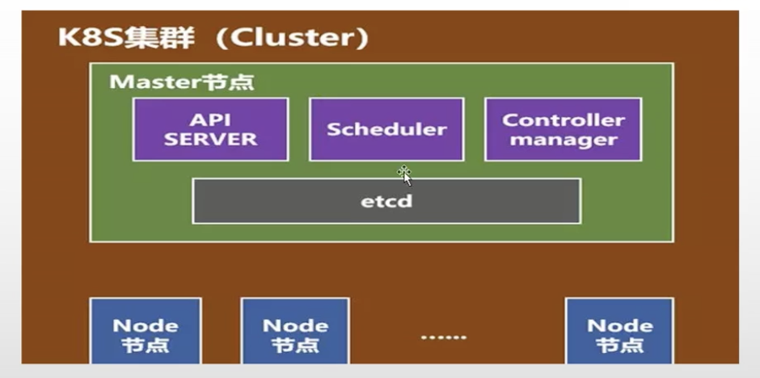
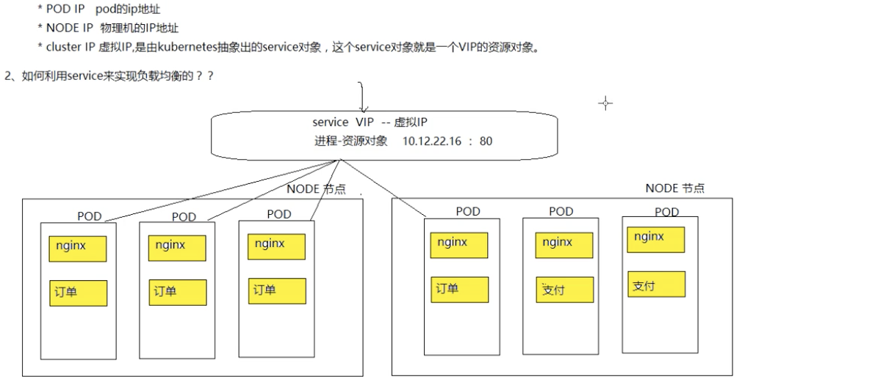
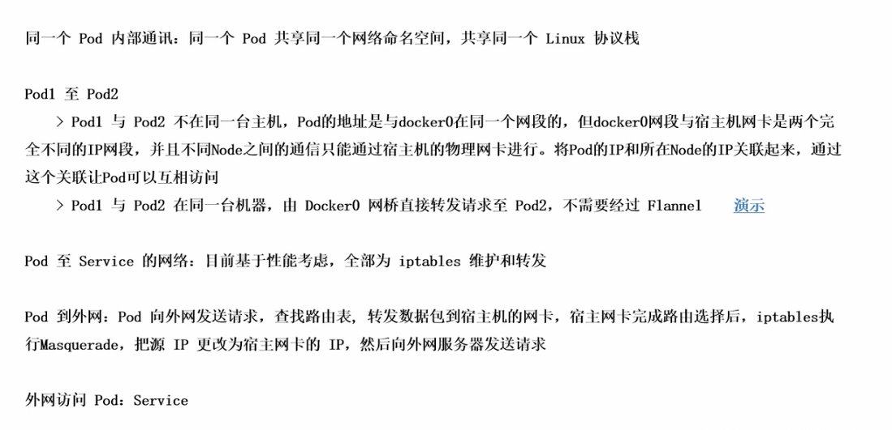

# 架构

==iaas 基础即服务==

==Pass 平台即服务==

​	ES/MYSQL/MQ

==saas 软件即服务==

​	钉钉

​	财务管理

==serverless==

​	server服务  less 无服务器


master节点

​	api server k8s 网管 所有的制定必须经过api server

​	scheduler 调度器,使用调度算法,吧请求资源调度某一个节点

​	controller 控制器,维护k8s资源算法

​	etcd 存储资源对象

==node 节点==

​	一个master 对应多个节点

node 节点

​	docker 运行容器的基础环境

​	kubelet 在每一个节点node都存在一份,在node节点上的资源操作指令由kubelet来执行

​	kube-proxy 代理服务 负载均衡

​	fluentd 日志收集服务

​	pod k8s 管理的基本单位 pod 内部是容器




node 节点

​	docker 运行容器的基础环境

# pod 核心原理

pod 可以理解成也是一个容器(这个容器中装的也是docker创建的容器,pod用来封装容器的一个容器)

虚拟化的分组,

<font color=red>pod有自己的ip地址 主机名,相当于一个独立的沙箱环境</font>

pod相当于独立主机,可以封装一个或者多个容器

pod通常情况下,在服务部署的时候,用pod来管理一组相关的服务,要么部署一个服务,要么部署一组有关系的服务


## pod架构


## 底层网络和数据存储


# ReplicaSet 副本控制器

ReplicationController 副本控制器

控制pod的数量,和预期设置的数量保持一致---永远


==ReplicSet和Replicationpntroller的区别==


建议使用ReplicaSet来作为副本控制器


# Deployment 部署对象

- 服务部署结构模型
- 滚动更新

==ReplicaSet不支持滚动更新,DEployment支持,所以 联合使用做到滚动更新==


# Statefulset 部署有状态服务

- 部署模型
- 有状态服务

为了解决有状态服务容器化部署的一个问题

<font color=red>MYSQL使用容器化部署,存在什么问题?</font>

- 容器是有生命周期的,一旦宕机,数据丢失
- pod部署,pod有生命周期,数据丢失

K8S来说,不能使用deployment部署模型来部署有状态服务,通常情况下,deploment被用来部署无状态的服务,那么对于有状态的服务的部署,使用statefulSet进行部署有状态的服务


状态服务的解释:

 - 有状态的服务
   	- 有==实时==的数据需要存储
      	- 有状态服务集群中,把某一个服务抽离出去,一段时间后在加入机器网络,如果集群服务无法使用
- 无状态服务
  - 没有==实时==数据需要存储
  - 在无状态的集群中,把某一个服务抽离出去,一段时间后再加入机器网络,对集群没有任何影响


# pod 的访问流程


==外部访问流程==


# ==services负载均衡==


- pod IP pod的ip地址
- NODE IP 物理机的ip地址
- cluster IP 虚拟ip 是有kuberNets抽象出来的services对象,这个service对象就是一个VIP对象




## service 的底层原理

- service 和pod 都是一个进程,service也不能对外网进行通信

- service和pod之间可以直接进行通信,他们之间的通信属于局域网通信
- 把请求交给service后,service使用(iptables,ipvs)做数据包的转发


<font color=red size=5x>service如何和pod进行关联的</font>

标签选择器

不同的一组pod 有不同service的进行进行负载均衡

- service 通过一组pod副本通过标签选择器进行关联
  - selector:
    - app = x 选择一组订单的服务的pod,创建一个service,
- endpoint 存储着对应的ip信息
- 


<font color=red size=5x>怎么发现服务down机的ip,hostname转换</font>

kube-proxy 来监控pod的变化,如果有变化,及时更新endpoint

- endpoint等信息存储在etcd中


#  sgg======================================================================

# 组件说明

borg架构


- api server 所有服务的统一入口
- contrallerManager 维持副本的期望数量
- Scheduler 负责介绍任务,选择合适的节点进行分配任务
- ETCD 键值对数据库,存储K8S集群所有的重要信息
- Kubelet 直接跟容器引擎交互的实现容器的生命周期管理
- KUbe-proxy:负责写入规则,IPVS IPTABLE实现服务访问注册发现


- CORENDS 可以为集群中的SVC**创建一个域名Ip的独赢关系解析**

- DASHBOARD 给K8S集群提供一个B/S结构访问体系

- INGRESS CONTROLLER 官方只能实现四层代理,其可以实现七层代理
- FEDETAION 提供一个可以跨集群中心多K8S统一 管理的功能
- PROMETHEUS 提供K8S的集群的监控功能
- ELK 提供K8S集群日志统一分析介入平台


kubelet 维护pod的生命周期


==etcd架构==


# pod 概念

- 自主式pod
- 控制管理的pod


1. <font color=red>一个pod中可能有多个容器</font>
2. <font color=red>共同用一个pause网络展,也公用一个存储</font>
3. <font color=red>pod之间的交互式本地访问localhost</font>
4. <font color=red>一个pod中不能有重复的端口</font>


# pod的管理器

## ReplicationController & ReplicationSet集合式 &Doploymentre更新


更新也不是删除老版本,只是停用

==可以滚动更新,也可以回滚==


## HPA


自动根据pod 利用CPU的多少进行扩容和回收


## statefulSet 有状态服务


# daemonSet


# JOb


# service服务发现

通过一组相同的标签来发现相同的服务


# 网络模型

- 同一个pod 通过localhost访问
- 各pod 之前通信 Overlay Network
- pod 和service之前的通信 ---各节点之间的Iptables




## Kubernets + flannel 


## service 网络


# 安装

在另一个安装.md中

```
https://blog.csdn.net/adson1987/article/details/106337079/
```

# 资源类型


# YAMl

- 缩进时不能使用TAB键,只允许使用空格

- 缩进的空格树木不重要,只要相同层级的元素左侧对其

-  #表示注释

  

==支持的数据格式==

- 对象 键值对的集合 有称为映射mapping 哈希hashes、 字典dictionary
- 数组 一组按照序列排列的值,又称为序列(sequence)、列表list
- 纯量scalars 单个的,不可再分的值

==对象类型==

```
name : stave
age : 18
```

也允许另外一种写法

```
hash :{name:steve,age:18}
```


==数组类型==

```
animal
- cat
- dog
```

数组也可以采用行内表示法

```
aniamal:[cat,dog]
```


==符合类型==

```
1 字符串 布尔值 整数 浮点数 null
2 时间 日期

数值直接一字面量的形式表示
number :12.30

布尔值用true和false表示
isSet:true

null用~表示
parent: ~

时间采用IS0860 格式
iso8601 2001-12-14t21:59:43.10-05:00

日期采用复合 iso8601 格式的年、月、日表示
date:1976-07-31

YAML 允许使用两个感叹号,强制转换数据类型
e:!!str 123
f:!!str true
```


==字符串==

字符串默认不使用引号表示

```
str :这是一个字符串
```

如果字符串之中包含空格和特殊字符,需要放在引号当中

```
s1:'内容\n字符串'
s2:'内容\n字符串'

```

单引号双引号都可以使用,<font color=red>双引号不会对字符进行转移</font>

```
s1:'内容\n字符串'
s2:"内容\n字符串“
```

单引号之中还有单引号,必须使用连续两个单引号转义

```
str:’labor’‘s day‘
```


字符串可以写成多行,从第二行开始,从第二行开始,必须有一个单空格缩进,换行符会被转为空格

```
str:这是一段
	多行
	字符串
```

字符串可以使用|保留换行符,也可以使用>折叠换行

```
this |
foo
bar
that:>
foo
bar
```

+表示保留文字块末尾的换行,-表示删除字符串末尾的换行

```
s1:|
	foo
s2 :|+
	foo
	
s3:|-
	foo
```

# Yaml 示例

```
# Copyright 2017 The Kubernetes Authors.
#
# Licensed under the Apache License, Version 2.0 (the "License");
# you may not use this file except in compliance with the License.
# You may obtain a copy of the License at
#
#     http://www.apache.org/licenses/LICENSE-2.0
#
# Unless required by applicable law or agreed to in writing, software
# distributed under the License is distributed on an "AS IS" BASIS,
# WITHOUT WARRANTIES OR CONDITIONS OF ANY KIND, either express or implied.
# See the License for the specific language governing permissions and
# limitations under the License.

# ------------------- Dashboard Secret ------------------- #

apiVersion: v1
kind: Secret
metadata:
  labels:
    k8s-app: kubernetes-dashboard
  name: kubernetes-dashboard-certs
  namespace: kube-system
type: Opaque

---
# ------------------- Dashboard Service Account ------------------- #

apiVersion: v1
kind: ServiceAccount
metadata:
  labels:
    k8s-app: kubernetes-dashboard
  name: kubernetes-dashboard
  namespace: kube-system

---
# ------------------- Dashboard Role & Role Binding ------------------- #

kind: Role
apiVersion: rbac.authorization.k8s.io/v1
metadata:
  name: kubernetes-dashboard-minimal
  namespace: kube-system
rules:
  # Allow Dashboard to create 'kubernetes-dashboard-key-holder' secret.
- apiGroups: [""]
  resources: ["secrets"]
  verbs: ["create"]
  # Allow Dashboard to create 'kubernetes-dashboard-settings' config map.
- apiGroups: [""]
  resources: ["configmaps"]
  verbs: ["create"]
  # Allow Dashboard to get, update and delete Dashboard exclusive secrets.
- apiGroups: [""]
  resources: ["secrets"]
  resourceNames: ["kubernetes-dashboard-key-holder", "kubernetes-dashboard-certs"]
  verbs: ["get", "update", "delete"]
  # Allow Dashboard to get and update 'kubernetes-dashboard-settings' config map.
- apiGroups: [""]
  resources: ["configmaps"]
  resourceNames: ["kubernetes-dashboard-settings"]
  verbs: ["get", "update"]
  # Allow Dashboard to get metrics from heapster.
- apiGroups: [""]
  resources: ["services"]
  resourceNames: ["heapster"]
  verbs: ["proxy"]
- apiGroups: [""]
  resources: ["services/proxy"]
  resourceNames: ["heapster", "http:heapster:", "https:heapster:"]
  verbs: ["get"]

---
apiVersion: rbac.authorization.k8s.io/v1
kind: RoleBinding
metadata:
  name: kubernetes-dashboard-minimal
  namespace: kube-system
roleRef:
  apiGroup: rbac.authorization.k8s.io
  kind: Role
  name: kubernetes-dashboard-minimal
subjects:
- kind: ServiceAccount
  name: kubernetes-dashboard
  namespace: kube-system

---
# ------------------- Dashboard Deployment ------------------- #

kind: Deployment
apiVersion: apps/v1
metadata:
  labels:
    k8s-app: kubernetes-dashboard
  name: kubernetes-dashboard
  namespace: kube-system
spec:
  replicas: 1
  revisionHistoryLimit: 10
  selector:
    matchLabels:
      k8s-app: kubernetes-dashboard
  template:
    metadata:
      labels:
        k8s-app: kubernetes-dashboard
    spec:
      containers:
      - name: kubernetes-dashboard
        image: k8s.gcr.io/kubernetes-dashboard-amd64:v1.10.1
        ports:
        - containerPort: 8443
          protocol: TCP
        args:
          - --auto-generate-certificates
          # Uncomment the following line to manually specify Kubernetes API server Host
          # If not specified, Dashboard will attempt to auto discover the API server and connect
          # to it. Uncomment only if the default does not work.
          # - --apiserver-host=http://my-address:port
        volumeMounts:
        - name: kubernetes-dashboard-certs
          mountPath: /certs
          # Create on-disk volume to store exec logs
        - mountPath: /tmp
          name: tmp-volume
        livenessProbe:
          httpGet:
            scheme: HTTPS
            path: /
            port: 8443
          initialDelaySeconds: 30
          timeoutSeconds: 30
      volumes:
      - name: kubernetes-dashboard-certs
        secret:
          secretName: kubernetes-dashboard-certs
      - name: tmp-volume
        emptyDir: {}
      serviceAccountName: kubernetes-dashboard
      # Comment the following tolerations if Dashboard must not be deployed on master
      tolerations:
      - key: node-role.kubernetes.io/master
        effect: NoSchedule

---
# ------------------- Dashboard Service ------------------- #

kind: Service
apiVersion: v1
metadata:
  labels:
    k8s-app: kubernetes-dashboard
  name: kubernetes-dashboard
  namespace: kube-system
spec:
  ports:
    - port: 443
      targetPort: 8443
  selector:
    k8s-app: kubernetes-dashboard
```


# 常用字段说明

官方文档

或者


## 必须存在的属性


主要对象


# 编写pod.yaml

```
apiVersion: v1
kind: Pod
metadata:
  name: myapp-pod
  labels:
    app: myapp
    version: v1
spec:
  containers:
    - name: app
      image: k8s.gcr.io/etcd:v1
```


# ==常用命令----------------------------==

==启动==

kubectl apply -f pod.yaml


==查看当前运行pod状态==

Kubectl get pod


Kubectl get pod  -o wide   详细信息


==查看pod的运行状态==

kubectl describe pod myapp-pod

```
Name:         myapp-pod
Namespace:    default
Priority:     0
Node:         docker-desktop/192.168.65.3
Start Time:   Sun, 28 Jun 2020 21:34:44 +0800
Labels:       app=myapp
              version=v1
Annotations:  kubectl.kubernetes.io/last-applied-configuration:
                {"apiVersion":"v1","kind":"Pod","metadata":{"annotations":{},"labels":{"app":"myapp","version":"v1"},"name":"myapp-pod","namespace":"defau...
Status:       Pending
IP:           10.1.0.51
Containers:
  app:
    Container ID:
    Image:          k8s.gcr.io/etcd:v1
    Image ID:
    Port:           <none>
    Host Port:      <none>
    State:          Waiting
      Reason:       ImagePullBackOff
    Ready:          False
    Restart Count:  0
    Environment:    <none>
    Mounts:
      /var/run/secrets/kubernetes.io/serviceaccount from default-token-rksmw (ro)
  test:
    Container ID:
    Image:          k8s.gcr.io/etcd:v1
    Image ID:
    Port:           <none>
    Host Port:      <none>
    State:          Waiting
      Reason:       ImagePullBackOff
    Ready:          False
    Restart Count:  0
    Environment:    <none>
    Mounts:
      /var/run/secrets/kubernetes.io/serviceaccount from default-token-rksmw (ro)
Conditions:
  Type              Status
  Initialized       True
  Ready             False
  ContainersReady   False
  PodScheduled      True
Volumes:
  default-token-rksmw:
    Type:        Secret (a volume populated by a Secret)
    SecretName:  default-token-rksmw
    Optional:    false
QoS Class:       BestEffort
Node-Selectors:  <none>
Tolerations:     node.kubernetes.io/not-ready:NoExecute for 300s
                 node.kubernetes.io/unreachable:NoExecute for 300s
Events:
  Type     Reason          Age                    From                     Message
  ----     ------          ----                   ----                     -------
  Normal   Scheduled       3m20s                  default-scheduler        Successfully assigned default/myapp-pod to docker-desktop
  Normal   SandboxChanged  3m1s                   kubelet, docker-desktop  Pod sandbox changed, it will be killed and re-created.
  Normal   Pulling         2m45s (x2 over 3m19s)  kubelet, docker-desktop  Pulling image "k8s.gcr.io/etcd:v1"
  Warning  Failed          2m30s (x2 over 3m1s)   kubelet, docker-desktop  Failed to pull image "k8s.gcr.io/etcd:v1": rpc error: code = Unknown desc = Error response from daemon: Get https://k8s.gcr.io/v2/: net/http: request canceled while waiting for connection (Client.Timeout exceeded while awaiting headers)
  Warning  Failed          2m30s (x2 over 3m1s)   kubelet, docker-desktop  Error: ErrImagePull
  Normal   BackOff         2m30s (x5 over 3m1s)   kubelet, docker-desktop  Back-off pulling image "k8s.gcr.io/etcd:v1"
  Warning  Failed          2m30s (x5 over 3m1s)   kubelet, docker-desktop  Error: ImagePullBackOff
  Normal   BackOff         2m17s (x4 over 3m1s)   kubelet, docker-desktop  Back-off pulling image "k8s.gcr.io/etcd:v1"
  Warning  Failed          2m17s (x4 over 3m1s)   kubelet, docker-desktop  Error: ImagePullBackOff
```


==查看pod运行日志==

kubectl log myapp-pod -c test

Kubectl log pod名称 -c 容器名称

```
log is DEPRECATED and will be removed in a future version. Use logs instead.
Error from server (BadRequest): container "test" in pod "myapp-pod" is waiting to start: trying and failing to pull image
```

  

==删除pod==

kubectl delete pod myapp-pod

kubectl delete pod    pod名称


==删除所有pod==

kubectl delete pod --all


==删除所有的deployment== 只删除pod 会不断的重建pod

kubectl delete deploment --all


==获取所有的svc--service== service 对外提供服务的

kubectl get svc


==删除svc==

kubectl delete svc 指定名称


==查看内部DNS服务解析==

kubectl get pod -n kube-system


# 容器的生命周期


<font color=red>Init C 进行容器初始化,初始化完成就会消失 >=1 甚至没有也行,是线性运行的</font>

<font color=red>pause 极简容器 在pod 在创建的时候就会生成,然后进行init C的创建</font>

<font color=red>readness 就绪检测,检测容器服务是否可用,可用修运行状态为runing</font>

<font color=red>liveness 生存检测,检测运行的容器是否是假死状态,重启服务</font>


## inti 容器


重启策略可以设置


## init C的简单编写

```
apiVersion: v1
kind: Pod
metadata:
	name: myapp-pod
	labels:
		app: myapp
		version: v1
spec:
	containers:
		-name: myapp-container
		images: busyBox
		command: ['sh','-c','echo The app is running! && sleep 3600']
	initContainers: //为pod创建初始化init时候使用
		-name: init-myservice
		image: busybox
		command: ['sh','-c','until nslookup myservice;do echo waiting for myservice;sleep 2;done;']
		- name: init-mydb
		image: busybox
		command: ['sh','-c','until nslookup mydb;do echo waiting foe mydb; sleep 2 done;]
```

```
创建需要的pod

kind: Service
appVersion: v1
metadata:
	name: myservice
spec: 
 ports:
 	-protocol: TCP
 	port: 80
 	targetPort: 9367

kind: Service
apiVersion: v1
metadata:
	name: mydb
spec:
	ports
		-protocol: TCP
		port:80
		targetPort: 9377
```


 