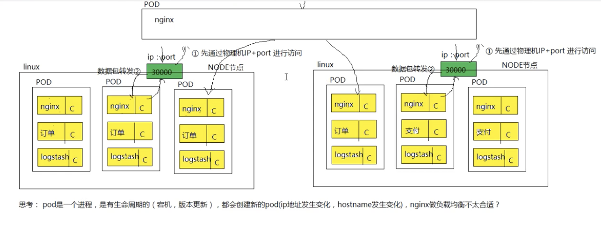
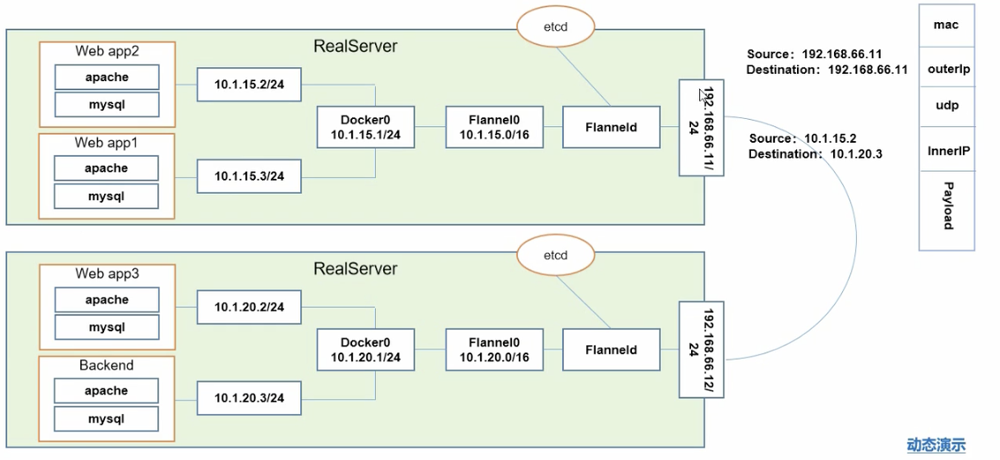

# 架构

==iaas 基础即服务==

==Pass 平台即服务==

​	ES/MYSQL/MQ

==saas 软件即服务==

​	钉钉

​	财务管理

==serverless==

​	server服务  less 无服务器


master节点

​	api server k8s 网管 所有的制定必须经过api server

​	scheduler 调度器,使用调度算法,吧请求资源调度某一个节点

​	controller 控制器,维护k8s资源算法

​	etcd 存储资源对象

==node 节点==

​	一个master 对应多个节点

node 节点

​	docker 运行容器的基础环境

​	kubelet 在每一个节点node都存在一份,在node节点上的资源操作指令由kubelet来执行

​	kube-proxy 代理服务 负载均衡

​	fluentd 日志收集服务

​	pod k8s 管理的基本单位 pod 内部是容器


node 节点

​	docker 运行容器的基础环境

# pod 核心原理

pod 可以理解成也是一个容器(这个容器中装的也是docker创建的容器,pod用来封装容器的一个容器)

虚拟化的分组,

<font color=red>pod有自己的ip地址 主机名,相当于一个独立的沙箱环境</font>

pod相当于独立主机,可以封装一个或者多个容器

pod通常情况下,在服务部署的时候,用pod来管理一组相关的服务,要么部署一个服务,要么部署一组有关系的服务


## pod架构


## 底层网络和数据存储


# ReplicaSet 副本控制器

ReplicationController 副本控制器

控制pod的数量,和预期设置的数量保持一致---永远


==ReplicSet和Replicationpntroller的区别==


建议使用ReplicaSet来作为副本控制器


# Deployment 部署对象

- 服务部署结构模型
- 滚动更新

==ReplicaSet不支持滚动更新,DEployment支持,所以 联合使用做到滚动更新==


# Statefulset 部署有状态服务

- 部署模型
- 有状态服务

为了解决有状态服务容器化部署的一个问题

<font color=red>MYSQL使用容器化部署,存在什么问题?</font>

- 容器是有生命周期的,一旦宕机,数据丢失
- pod部署,pod有生命周期,数据丢失

K8S来说,不能使用deployment部署模型来部署有状态服务,通常情况下,deploment被用来部署无状态的服务,那么对于有状态的服务的部署,使用statefulSet进行部署有状态的服务


状态服务的解释:

 - 有状态的服务
   	- 有==实时==的数据需要存储
   	- 有状态服务集群中,把某一个服务抽离出去,一段时间后在加入机器网络,如果集群服务无法使用
- 无状态服务
  - 没有==实时==数据需要存储
  - 在无状态的集群中,把某一个服务抽离出去,一段时间后再加入机器网络,对集群没有任何影响


# pod 的访问流程


==外部访问流程==


# ==services负载均衡==




- pod IP pod的ip地址
- NODE IP 物理机的ip地址
- cluster IP 虚拟ip 是有kuberNets抽象出来的services对象,这个service对象就是一个VIP对象


## service 的底层原理

- service 和pod 都是一个进程,service也不能对外网进行通信

- service和pod之间可以直接进行通信,他们之间的通信属于局域网通信
- 把请求交给service后,service使用(iptables,ipvs)做数据包的转发


<font color=red size=5x>service如何和pod进行关联的</font>

标签选择器

不同的一组pod 有不同service的进行进行负载均衡

- service 通过一组pod副本通过标签选择器进行关联
  - selector:
    - app = x 选择一组订单的服务的pod,创建一个service,
- endpoint 存储着对应的ip信息
- 


<font color=red size=5x>怎么发现服务down机的ip,hostname转换</font>

kube-proxy 来监控pod的变化,如果有变化,及时更新endpoint

- endpoint等信息存储在etcd中


#  sgg======================================================================

# 组件说明

borg架构


- api server 所有服务的统一入口
- contrallerManager 维持副本的期望数量
- Scheduler 负责介绍任务,选择合适的节点进行分配任务
- ETCD 键值对数据库,存储K8S集群所有的重要信息
- Kubelet 直接跟容器引擎交互的实现容器的生命周期管理
- KUbe-proxy:负责写入规则,IPVS IPTABLE实现服务访问注册发现


- CORENDS 可以为集群中的SVC**创建一个域名Ip的独赢关系解析**

- DASHBOARD 给K8S集群提供一个B/S结构访问体系

- INGRESS CONTROLLER 官方只能实现四层代理,其可以实现七层代理
- FEDETAION 提供一个可以跨集群中心多K8S统一 管理的功能
- PROMETHEUS 提供K8S的集群的监控功能
- ELK 提供K8S集群日志统一分析介入平台


kubelet 维护pod的生命周期


==etcd架构==


# pod 概念

- 自主式pod
- 控制管理的pod


1. <font color=red>一个pod中可能有多个容器</font>
2. <font color=red>共同用一个pause网络展,也公用一个存储</font>
3. <font color=red>pod之间的交互式本地访问localhost</font>
4. <font color=red>一个pod中不能有重复的端口</font>


# pod的管理器

## ReplicationController & ReplicationSet集合式 &Doploymentre更新


更新也不是删除老版本,只是停用

==可以滚动更新,也可以回滚==


## HPA


自动根据pod 利用CPU的多少进行扩容和回收


## statefulSet 有状态服务


# daemonSet


# JOb


# service服务发现

通过一组相同的标签来发现相同的服务


# 网络模型

- 同一个pod 通过localhost访问
- 各pod 之前通信 Overlay Network
- pod 和service之前的通信 ---各节点之间的Iptables


## Kubernets + flannel 





## service 网络


# 安装

步骤

1. 安装 docker for mac (略去）

2. 安装最新版本的go (略去）

3. 安装kind

```text
export PATH=$PATH:/Users/andywang/go/bin/

#GO111MODULE="on" go get sigs.k8s.io/kind@v0.5.1
go: finding github.com/golang/protobuf v0.0.0-20161109072736-4bd1920723d7
go: finding golang.org/x/tools v0.0.0-20181011042414-1f849cf54d09
go: finding golang.org/x/tools v0.0.0-20180221164845-07fd8470d635
...
go: extracting golang.org/x/text v0.3.2
```

4. 通过kind安装cluster

```text
# kind create cluster
Creating cluster "kind" ...
 ✓ Ensuring node image (kindest/node:v1.15.3)  
 ✓ Preparing nodes  
 ✓ Creating kubeadm config  
 ✓ Starting control-plane  ️
 ✓ Installing CNI  
 ✓ Installing StorageClass  
Cluster creation complete. You can now use the cluster with:


 andywang@andywang-mbp  ~/.kube  export KUBECONFIG="$(kind get kubeconfig-path)"
kubectl cluster-info
Kubernetes master is running at https://127.0.0.1:54056
KubeDNS is running at https://127.0.0.1:54056/api/v1/namespaces/kube-system/services/kube-dns:dns/proxy

 andywang@andywang-mbp  ~/.kube  kubectl get nodes
NAME                 STATUS   ROLES    AGE     VERSION
kind-control-plane   Ready    master   4m15s   v1.15.3

这个安装的默认的master,没有worker node.我们删掉他。重新创建

#wget -c https://raw.githubusercontent.com/kubernetes-sigs/kind/master/site/content/docs/user/kind-example-config.yaml


# kind create cluster --name kind2 --config kind-example-config.yaml

andywang@andywang-mbp  ~/.kube  kind create cluster --name kind2 --config kind-example-config.yaml --loglevel trace --wait 5m
Creating cluster "kind2" ...
 ✓ Ensuring node image (kindest/node:v1.15.3)  
⠈⠑ Preparing nodes    
....
 ✓ Waiting ≤ 5m0s for control-plane = Ready ⏳
 • Ready after 1m6s  


✘ andywang@andywang-mbp  ~/.kube  kubectl cluster-info
Kubernetes master is running at https://127.0.0.1:57630
KubeDNS is running at https://127.0.0.1:57630/api/v1/namespaces/kube-system/services/kube-dns:dns/proxy

To further debug and diagnose cluster problems, use 'kubectl cluster-info dump'.
 andywang@andywang-mbp  ~/.kube  kubectl get nodes
NAME                  STATUS   ROLES    AGE     VERSION
kind2-control-plane   Ready    master   3m10s   v1.15.3
kind2-worker          Ready    <none>   2m27s   v1.15.3
kind2-worker2         Ready    <none>   2m27s   v1.15.3
kind2-worker3         Ready    <none>   2m26s   v1.15.3

 andywang@andywang-mbp  ~/.kube  kubectl get pods -n kube-system
NAME                                          READY   STATUS    RESTARTS   AGE
coredns-5c98db65d4-8vk6s                      1/1     Running   0          3m12s
coredns-5c98db65d4-lh7xd                      1/1     Running   0          3m12s
etcd-kind2-control-plane                      1/1     Running   0          2m44s
kindnet-bcw95                                 1/1     Running   1          3m12s
kindnet-ds2cn                                 1/1     Running   1          2m52s
kindnet-jb9ts                                 1/1     Running   1          2m52s
kindnet-wm7m6                                 1/1     Running   1          2m54s
kube-apiserver-kind2-control-plane            1/1     Running   0          2m37s
kube-controller-manager-kind2-control-plane   1/1     Running   1          2m33s
kube-proxy-8m66m                              1/1     Running   0          3m12s
kube-proxy-gsfn7                              1/1     Running   0          2m51s
kube-proxy-mkw6k                              1/1     Running   0          2m52s
kube-proxy-xldp9                              1/1     Running   0          2m54s
kube-scheduler-kind2-control-plane            1/1     Running   2          2m44s
 andywang@andywang-mbp  ~/.kube 
```


 