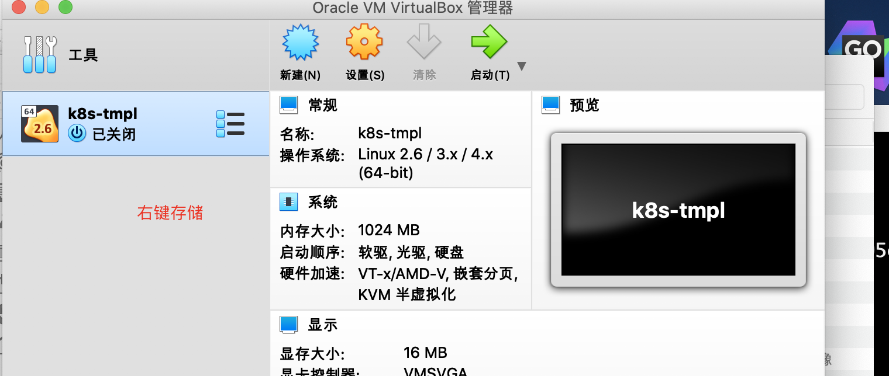
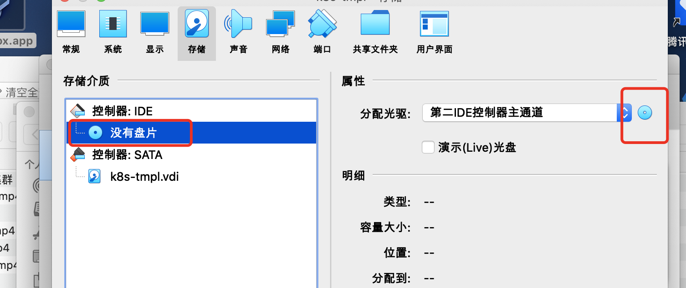
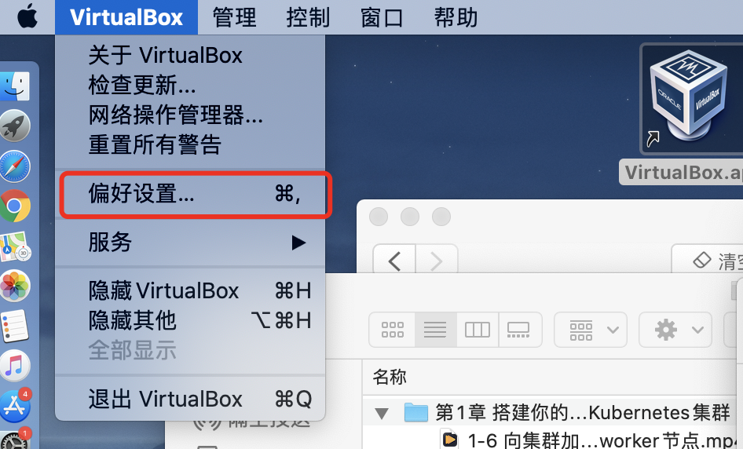
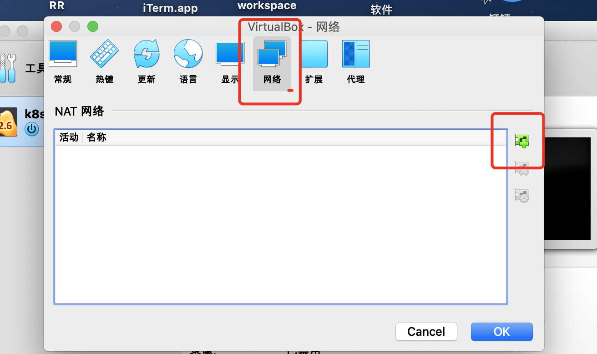
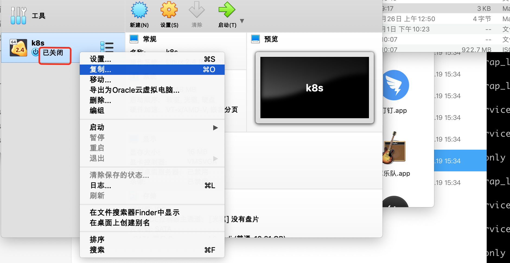
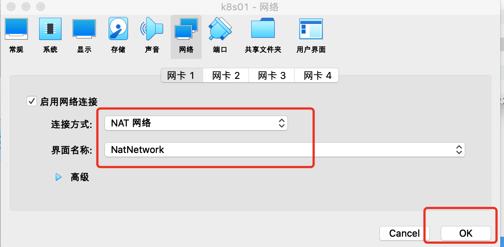
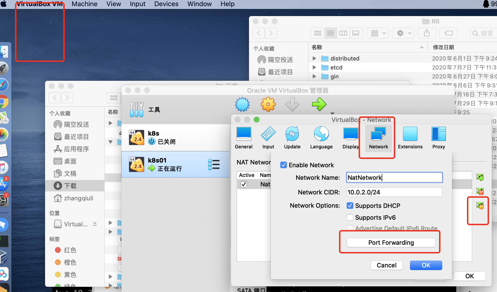
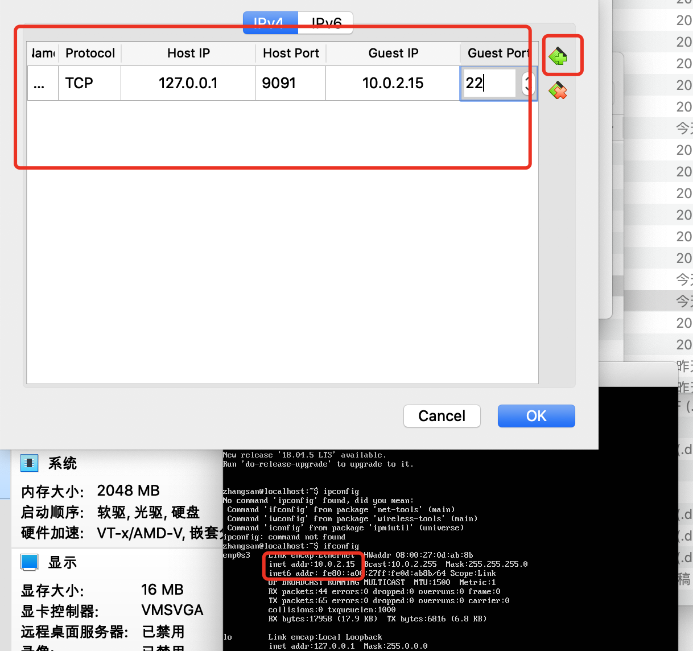
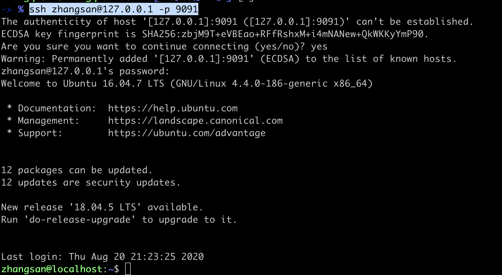
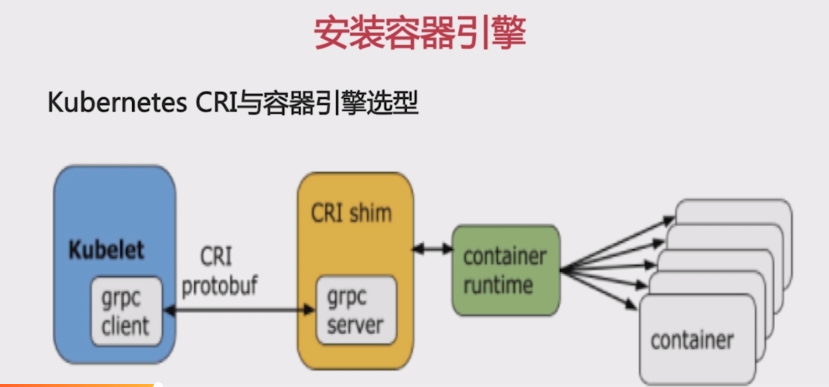

# 安装

安装VirtualBox

```
下载
https://www.cnblogs.com/andong2015/p/7688120.html
一路下一步


```

内存 1024MB

磁盘 20 G


==设置挂载文件==





下载ubuntu-16.04.4-server iso 安装文件

```
清华大学
wget -c https://mirrors.tuna.tsinghua.edu.cn/ubuntu-releases/16.04/ubuntu-16.04.7-server-amd64.iso
```


选择刚才的下载的unubtu镜像文件

启动虚拟机 安装 ==安装英文版,中文版有bug==


==设置网络==





点击ok就好

<font color=red size=5x>给模版机安装openssh</font>

sudo su -  切换root用户

1.检测是否已安装ssh服务，输入以下命令

```
$  ssh localhost
```

出现以下提示则为未安装： 
ssh: connect to host localhost port 22: Connection refused 
（ssh：连接到主机本地主机端口22：连接被拒绝）

2.安装ssh-server

```
$ sudo apt-get install openssh-server
```

3.启动服务

```
$ sudo /etc/init.d/ssh start
```

启动成功会提示： 
[ ok ] Starting ssh (via systemctl): ssh.service.

4.检查服务是否启动成功

```
$ ps -e|grep ssh
```

若有下面提示则启动成功 
6455 ? 00:00:00 sshd


启动、停止、重启SSH命令：

```
$ sudo /etc/init.d/ssh start          //启动SSH命令
```

```
$ sudo /etc/init.d/ss stop           //停止SSH命令，重新连接你会发现不能再连接上了
```

```
$ sudo /etc/init.d/ss restart        //重启SSH命令
```

系统默认端口为22，修改可执行以下命令：

```
$ sudo vim /etc/ssh/sshd_config
```

找到

“# Port 22”改为 “Port 你想要的端口” (没有#号，#代表注释意思。) 例如→”Port 33”（前提得保证这个端口没有被占用） 
然后保存退出，再重启下服务即可生效

开启服务即刻在putty 连接，同时也可以通过sftp方式连接进行管理文件

卸载SSH服务:

```
$ sudo /etc/init.d/ss stop


$ sudo apt-get remove openssh-sftp-server                    //卸载sftp服务


$ sudo apt-get remove openssh-server      
```


<font color=red size=5x>基于模版创建三个节点</font>




设置k8s01的网络




<font color=red size=5x>通过端口转发 ssh登陆</font>






<font color=red size=5x>测试登陆</font>

```
ssh zhangsan@127.0.0.1 -p 9091
```




#  安装容器引擎




选择并安装docker 

作为容器运行时17.03.2-ce版本

安装

1. 更新包索引

   ```
   apt-get update
   ```

2. 下载docker公钥添加到公钥库中

   使用docker官方源

   ```
   curl -fsSl https://download.docker.com/linux/ubuntu/gpg |apt-key add -
   ```

3. 添加docker官方源仓库

   ```
   add-apt-repository "deb [arch=amd64] https://download.docker.com/linux/ubuntu $(lsb_release -cs) stable"
   ```

   vim /etc/apt/sources.list

   最后一行

   ```
   deb [arch=amd64] https://download.docker.com/linux/ubuntu xenial stable
   ```

4. 更新包索引

   ```
   apt-get update
   ```

5. 安装docker

6. 查看版本

   ```
   apt-cache madison docker-ce
   ```

7. 安装

   ```
   apt-get install docker-ce=17.03.2~ce-0~ubuntu-xenial
   ```

8. 验证

   ```
   docker version
   ```

9. 查看docker的后台服务状态

   ```
   systemctl status docker
   ```

10. 运行hello-world

    ```
    docker run hello-world
    ```

    

# 下载Kubeadm、node组件和命令行工具

## 安装kubeadm、kubelet、kubectl

1. 添加kubernets apt源

   ```
   curl -s https://packages.cloud.google.com/apt/doc/apt-key.gpg |apt-key add -
   ```

   


