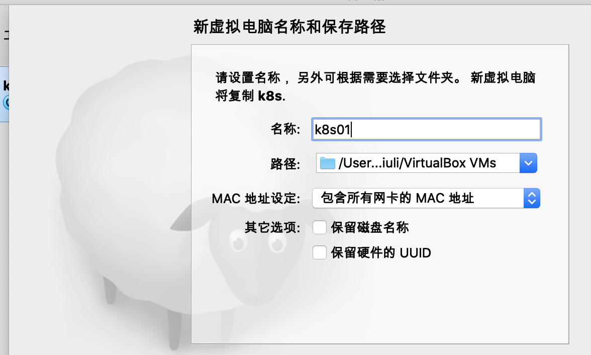

# 安装

安装VirtualBox

```
下载
https://www.cnblogs.com/andong2015/p/7688120.html
一路下一步


```

内存 1024MB

磁盘 20 G


==设置挂载文件==


下载ubuntu-16.04.4-server iso 安装文件

```
清华大学
wget -c https://mirrors.tuna.tsinghua.edu.cn/ubuntu-releases/16.04/ubuntu-16.04.7-server-amd64.iso
```


选择刚才的下载的unubtu镜像文件

启动虚拟机 安装 ==安装英文版,中文版有bug==


==设置网络==


点击ok就好

<font color=red size=5x>给模版机安装openssh</font>

sudo su -  切换root用户

1.检测是否已安装ssh服务，输入以下命令

```
$  ssh localhost
```

出现以下提示则为未安装： 
ssh: connect to host localhost port 22: Connection refused 
（ssh：连接到主机本地主机端口22：连接被拒绝）

2.安装ssh-server

```
$ sudo apt-get install openssh-server
```

3.启动服务

```
$ sudo /etc/init.d/ssh start
```

启动成功会提示： 
[ ok ] Starting ssh (via systemctl): ssh.service.

4.检查服务是否启动成功

```
$ ps -e|grep ssh
```

若有下面提示则启动成功 
6455 ? 00:00:00 sshd


启动、停止、重启SSH命令：

```
$ sudo /etc/init.d/ssh start          //启动SSH命令
```

```
$ sudo /etc/init.d/ss stop           //停止SSH命令，重新连接你会发现不能再连接上了
```

```
$ sudo /etc/init.d/ss restart        //重启SSH命令
```

系统默认端口为22，修改可执行以下命令：

```
$ sudo vim /etc/ssh/sshd_config
```

找到

“# Port 22”改为 “Port 你想要的端口” (没有#号，#代表注释意思。) 例如→”Port 33”（前提得保证这个端口没有被占用） 
然后保存退出，再重启下服务即可生效

开启服务即刻在putty 连接，同时也可以通过sftp方式连接进行管理文件

卸载SSH服务:

```
$ sudo /etc/init.d/ss stop


$ sudo apt-get remove openssh-sftp-server                    //卸载sftp服务


$ sudo apt-get remove openssh-server      
```


<font color=red size=5x>基于模版创建三个节点</font>





设置k8s01的网络


<font color=red size=5x>通过端口转发 ssh登陆</font>


<font color=red size=5x>测试登陆</font>

```
ssh zhangsan@127.0.0.1 -p 9091
```


#  安装容器引擎


选择并安装docker 

作为容器运行时17.03.2-ce版本

安装

1. 更新包索引

   ```
   apt-get update
   ```

2. 下载docker公钥添加到公钥库中

   使用docker官方源

   ```
   curl -fsSl https://download.docker.com/linux/ubuntu/gpg |apt-key add -
   ```

3. 添加docker官方源仓库

   ```
   add-apt-repository "deb [arch=amd64] https://download.docker.com/linux/ubuntu $(lsb_release -cs) stable"
   ```

   vim /etc/apt/sources.list

   最后一行

   ```
   deb [arch=amd64] https://download.docker.com/linux/ubuntu xenial stable
   ```

4. 更新包索引

   ```
   apt-get update
   ```

5. 安装docker

6. 查看版本

   ```
   apt-cache madison docker-ce
   ```

7. 安装

   ```
   apt-get install docker-ce=17.03.2~ce-0~ubuntu-xenial
   ```

8. 验证

   ```
   docker version
   ```

9. 查看docker的后台服务状态

   ```
   systemctl status docker
   ```

10. 运行hello-world

    ```
    docker run hello-world
    ```

    

# 下载Kubeadm、node组件和命令行工具

## 安装kubeadm、kubelet、kubectl

1. 添加kubernets apt源

   ```
   curl -s https://packages.cloud.google.com/apt/doc/apt-key.gpg |apt-key add -
   ```

2. 添加kubernets官方源

   ```
   deb http://apt.kubernetes.io/ kubernets-xenial main
   ```

   ```shell
   apt-get update && apt-get install -y apt-transport-https
   curl https://mirrors.aliyun.com/kubernetes/apt/doc/apt-key.gpg | apt-key add - 
   cat <<EOF >/etc/apt/sources.list.d/kubernetes.list
   deb https://mirrors.aliyun.com/kubernetes/apt/ kubernetes-xenial main
   EOF  
   apt-get update
   apt-get install -y kubelet kubeadm kubectl
   ```

<font color=red size=5x>正解</font>

- 修改操作系统镜像源

```shell
#打开终端，进入/etc/apt/
cd /etc/apt
#对sources.list 文件进行备份
sudo cp sources.list sources.list.backup
#修改文件
sudo gedit sources.list
#删除掉source.list 里的所有内容，然后选择清华源粘出来
deb http://mirrors.tuna.tsinghua.edu.cn/ubuntu/ xenial main restricted
deb http://mirrors.tuna.tsinghua.edu.cn/ubuntu/ xenial-updates main restricted
deb http://mirrors.tuna.tsinghua.edu.cn/ubuntu/ xenial universe
deb http://mirrors.tuna.tsinghua.edu.cn/ubuntu/ xenial-updates universe
deb http://mirrors.tuna.tsinghua.edu.cn/ubuntu/ xenial multiverse
deb http://mirrors.tuna.tsinghua.edu.cn/ubuntu/ xenial-updates multiverse
deb http://mirrors.tuna.tsinghua.edu.cn/ubuntu/ xenial-backports main restricted universe multiverse
deb http://mirrors.tuna.tsinghua.edu.cn/ubuntu/ xenial-security main restricted
deb http://mirrors.tuna.tsinghua.edu.cn/ubuntu/ xenial-security universe 
deb http://mirrors.tuna.tsinghua.edu.cn/ubuntu/ xenial-security multiverse
#保存后记得更新一下
sudo apt-get update
```

没有就创建文件

```shell
apt-get update && apt-get install -y apt-transport-https
curl https://mirrors.aliyun.com/kubernetes/apt/doc/apt-key.gpg | apt-key add - 
cat <<EOF >/etc/apt/sources.list.d/kubernetes.list
deb https://mirrors.aliyun.com/kubernetes/apt/ kubernetes-xenial main
EOF  
apt-get update
apt-get install -y kubelet kubeadm kubectl
```

验证

```
kubeadm version
```

kubeadm version: &version.Info{Major:"1", Minor:"18", GitVersion:"v1.18.8", GitCommit:"9f2892aab98fe339f3bd70e3c470144299398ace", GitTreeState:"clean", BuildDate:"2020-08-13T16:10:16Z", GoVersion:"go1.13.15", Compiler:"gc", Platform:"linux/amd64"}

```
kubectl version
Client Version: version.Info{Major:"1", Minor:"18", GitVersion:"v1.18.8", GitCommit:"9f2892aab98fe339f3bd70e3c470144299398ace", GitTreeState:"clean", BuildDate:"2020-08-13T16:12:48Z", GoVersion:"go1.13.15", Compiler:"gc", Platform:"linux/amd64"}
The connection to the server localhost:8080 was refused - did you specify the right host or port?
```

查看kubelet 状态

处于定期重启状态

```
systemctl status kubelet
```

```
● kubelet.service - kubelet: The Kubernetes Node Agent
   Loaded: loaded (/lib/systemd/system/kubelet.service; enabled; vendor preset: enabled)
  Drop-In: /etc/systemd/system/kubelet.service.d
           └─10-kubeadm.conf
   Active: activating (auto-restart) (Result: exit-code) since Fri 2020-08-21 00:16:29 CST; 9s ago
     Docs: https://kubernetes.io/docs/home/
  Process: 6649 ExecStart=/usr/bin/kubelet $KUBELET_KUBECONFIG_ARGS $KUBELET_CONFIG_ARGS $KUBELET_KUBEADM_ARGS $KUBELET_
 Main PID: 6649 (code=exited, status=255)

Aug 21 00:16:29 localhost systemd[1]: kubelet.service: Main process exited, code=exited, status=255/n/a
Aug 21 00:16:29 localhost systemd[1]: kubelet.service: Unit entered failed state.
Aug 21 00:16:29 localhost systemd[1]: kubelet.service: Failed with result 'exit-code'.
```


# 核心组件镜像列表及手工下载镜像实操


# 基础架构


## kubeadm init

1. 引导前检查
2. 生成公钥和私钥数字证书
3. 生成控制平面组件
4. 


## 引导前检查

```
kubeadm init pre-flight check:

```


# kubectl

## 访问集群配置

```
kubectl config

kubectl config get-cluster
```

###  ==查看当前配置内容==

```
kubectl config view
```


### ==创建集群入口==

```
kubectl config set-cluster k8s1 --server=http://1.2.3.4
```


###  ==查看集群配置==

```
kubectl config get-clusters
```


### ==删除配置文件中的创建集群信息==

```
kubectl config delete-cluster k8s1
```


### ==在配置文件创建context入口==

```
kubectl config set-context admin12k8s1 --user=admin1
```


###  ==查看当前context==

```
kubectl config get-contexts
```


### ==查看当前集群配置当前值==

```
kubectl config current-context
```


###  ==设置要使用的context==

```
kubectl config use-context admin@k8s1
```

### ==删除context==

```
kubectl config delete-context admin@k8s1
```

###  ==创建一个新的用户==

```
kubectl config set-credentials admin1 --username=admin --password=abcde
```

## 集群控制

```
kubectl create/apply/delete/lable/edit/expose/scale
```

### ==创建pod==

```
kubectl create -f nginx-deployment.yaml
```


### ==查看pod==

```
kubectl get pods --show-labels|grep deployment
```


## 集群查看和问题调试

```
kubectl get/describe/logs/exec/attach
```

# 安装docker--unbutu18

https://zhang0peter.com/2020/01/30/k8s-install-and-use-and-fix-bug/

```
curl -fsSL https://mirrors.ustc.edu.cn/docker-ce/linux/ubuntu/gpg | sudo apt-key add -

add-apt-repository "deb https://mirrors.ustc.edu.cn/docker-ce/linux/ubuntu $(lsb_release -cs) stable"

apt update && apt install docker-ce

docker run hello-world
```


## 安装kubernetes

docker成功运行后配置k8s的更新源，推荐阿里云:

```
echo "deb https://mirrors.aliyun.com/kubernetes/apt/ kubernetes-xenial main" | sudo tee -a /etc/apt/sources.list.d/kubernetes.list

sudo gpg --keyserver keyserver.ubuntu.com --recv-keys BA07F4FB #对安装包进行签名

sudo gpg --export --armor BA07F4FB | sudo apt-key add -

sudo apt-get update
```

关闭虚拟内存

```
sudo swapoff -a #暂时关闭
nano /etc/fstab #永久关闭，注释掉swap那一行，推荐永久关闭
```

安装最新版的k8s：

```
apt-get install kubelet kubeadm kubectl kubernetes-cni
```

其中`kubeadm`用于初始化环境，`kubectl`用于操作`kubelet`。 设置开机启动：

```
sudo systemctl enable kubelet && systemctl start kubelet
```

查看`kubectl`版本：

```
root@ubuntu:/home/ubuntu# kubectl version
Client Version: version.Info{Major:"1", Minor:"17", GitVersion:"v1.17.2", GitCommit:"59603c6e503c87169aea6106f57b9f242f64df89", GitTreeState:"clean", BuildDate:"2020-01-18T23:30:10Z", GoVersion:"go1.13.5", Compiler:"gc", Platform:"linux/amd64"}
The connection to the server localhost:8080 was refused - did you specify the right host or port?
```

## 配置k8s集群

刚刚已经装好一台虚拟机的k8s，现在要配置2台额外的虚拟机，总共3台，形成k8s集群。

推荐的做法是直接使用`vmware`自带的克隆功能，这样可以免去重装的烦恼。

共3台机器，分别为 master, node1, node2.

### 配置虚拟机网络

在`/etc/hostname`中配置主节点为master,node1为 node1,node2为 node2

配置每台机器的`/etc/netplan/50-cloud-init.yaml`，把DHCP的IP改为固定IP：

```
network:
    ethernets:
        ens33:
            addresses: [192.168.32.132/24]
            dhcp4: false
            gateway4: 192.168.32.2
            nameservers:
                addresses: [192.168.32.2]
            optional: true
    version: 2
```

修改`/etc/hosts`

```
192.168.32.132 master
192.168.32.133 node1
192.168.32.134 node2
```

重启机器后能互相ping表示配置成功：

```
ubuntu@node2:~$ ping master
PING master (192.168.32.132) 56(84) bytes of data.
64 bytes from master (192.168.32.132): icmp_seq=1 ttl=64 time=0.837 ms
64 bytes from master (192.168.32.132): icmp_seq=2 ttl=64 time=0.358 ms
```

### 配置Master节点的k8s，并使用 kubeadm 拉取镜像

使用`kubeadm init`进行初始化操作：

```
#修改IP地址为master节点的IP地址并配置pod地址
kubeadm init \
--apiserver-advertise-address=192.168.1.100 \
--image-repository registry.aliyuncs.com/google_containers  \
--pod-network-cidr=10.244.0.0/16 
root@master:/home/ubuntu# kubeadm init \
> --apiserver-advertise-address=192.168.32.132 \
> --image-repository registry.aliyuncs.com/google_containers  \
> --pod-network-cidr=10.244.0.0/16 
W0131 07:58:41.470780    4096 version.go:101] could not fetch a Kubernetes version from the internet: unable to get URL "https://dl.k8s.io/release/stable-1.txt": Get https://dl.k8s.io/release/stable-1.txt: net/http: request canceled while waiting for connection (Client.Timeout exceeded while awaiting headers)
W0131 07:58:41.470831    4096 version.go:102] falling back to the local client version: v1.17.2
W0131 07:58:41.470908    4096 validation.go:28] Cannot validate kube-proxy config - no validator is available
W0131 07:58:41.470912    4096 validation.go:28] Cannot validate kubelet config - no validator is available
[init] Using Kubernetes version: v1.17.2
[preflight] Running pre-flight checks
	[WARNING IsDockerSystemdCheck]: detected "cgroupfs" as the Docker cgroup driver. The recommended driver is "systemd". Please follow the guide at https://kubernetes.io/docs/setup/cri/
[preflight] Pulling images required for setting up a Kubernetes cluster
[preflight] This might take a minute or two, depending on the speed of your internet connection
[preflight] You can also perform this action in beforehand using 'kubeadm config images pull'
........................
Your Kubernetes control-plane has initialized successfully!

To start using your cluster, you need to run the following as a regular user:

  mkdir -p $HOME/.kube
  sudo cp -i /etc/kubernetes/admin.conf $HOME/.kube/config
  sudo chown $(id -u):$(id -g) $HOME/.kube/config

You should now deploy a pod network to the cluster.
Run "kubectl apply -f [podnetwork].yaml" with one of the options listed at:
  https://kubernetes.io/docs/concepts/cluster-administration/addons/

Then you can join any number of worker nodes by running the following on each as root:

kubeadm join 192.168.32.132:6443 --token uf5mqk.bssr36md2y6b7w7g \
    --discovery-token-ca-cert-hash sha256:fa6e8c828a4480baf8dba2331bcaad4d30ae593024e0a56258cf22fdde3f897a
ubuntu@master:~/k8s$   mkdir -p $HOME/.kube
ubuntu@master:~/k8s$   sudo cp -i /etc/kubernetes/admin.conf $HOME/.kube/config
ubuntu@master:~/k8s$   sudo chown $(id -u):$(id -g) $HOME/.kube/config
```

创建系统服务并启动

```
# 启动kubelet 设置为开机自启动
sudo systemctl enable kubelet
# 启动k8s服务程序
sudo systemctl start kubelet
```

查看启动状况：

```
ubuntu@master:~/k8s$ kubectl get nodes
NAME     STATUS     ROLES    AGE     VERSION
master   NotReady   master   7m53s   v1.17.2
ubuntu@master:~/k8s$ kubectl get cs
NAME                 STATUS    MESSAGE             ERROR
controller-manager   Healthy   ok                  
scheduler            Healthy   ok                  
etcd-0               Healthy   {"health":"true"}  
```

现在只有一个master节点。

### 配置内部通信 flannel 网络(master和node都要配)

先配置内部通信 flannel 网络：

```
wget https://raw.githubusercontent.com/coreos/flannel/master/Documentation/kube-flannel.yml
```

确保kubeadm.conf中的podsubnet的地址和kube-flannel.yml中的网络配置一样

加载配置文件：

```
ubuntu@master:~/k8s$ kubectl apply -f kube-flannel.yml 
podsecuritypolicy.policy/psp.flannel.unprivileged created
clusterrole.rbac.authorization.k8s.io/flannel configured
clusterrolebinding.rbac.authorization.k8s.io/flannel unchanged
serviceaccount/flannel unchanged
configmap/kube-flannel-cfg configured
daemonset.apps/kube-flannel-ds-amd64 created
daemonset.apps/kube-flannel-ds-arm64 created
daemonset.apps/kube-flannel-ds-arm created
daemonset.apps/kube-flannel-ds-ppc64le created
daemonset.apps/kube-flannel-ds-s390x created
```

状态变为ready:

```
ubuntu@master:~/k8s$ kubectl get nodes
NAME     STATUS   ROLES    AGE   VERSION
master   Ready    master   39m   v1.17.2
```

如果没变为ready应该是镜像下载失败，手动下载，镜像版本由当前flannel版本决定。

```
docker pull quay-mirror.qiniu.com/coreos/flannel:v0.11.0-amd64
docker tag quay-mirror.qiniu.com/coreos/flannel:v0.11.0-amd64 quay.io/coreos/flannel:v0.11.0-amd64
```

### 配置 node节点

```
sudo systemctl enable kubelet
sudo systemctl start kubelet
```

拷贝配置文件到每个node:

```
scp /etc/kubernetes/admin.conf ubuntu@node1:/home/ubuntu/
scp /etc/kubernetes/admin.conf ubuntu@node2:/home/ubuntu/
```

配置并加入节点，加入中的哈希值是之前配置时生成的。

```
mkdir -p $HOME/.kube
sudo cp -i $HOME/admin.conf $HOME/.kube/config
sudo chown $(id -u):$(id -g) $HOME/.kube/config
kubeadm join 192.168.32.132:6443 --token uf5mqk.bssr36md2y6b7w7g \
    --discovery-token-ca-cert-hash sha256:fa6e8c828a4480baf8dba2331bcaad4d30ae593024e0a56258cf22fdde3f897a
```

查看node是否已经加入到k8s集群中(需要等一段时间才能ready):

```
ubuntu@master:~$ kubectl get nodes
NAME     STATUS     ROLES    AGE     VERSION
master   Ready      master   5h8m    v1.17.2
node1    Ready      <none>   3h21m   v1.17.2
node2    Ready      <none>   3h20m   v1.17.2
```

出现报错参考后面的报错解决。

## 部署ningx应用，测试集群

在Kubernetes集群中创建一个pod，验证是否正常运行：

```
ubuntu@master:~$ kubectl create deployment nginx --image=nginx
deployment.apps/nginx created
ubuntu@master:~$ kubectl expose deployment nginx --port=80 --type=NodePort
service/nginx exposed
ubuntu@master:~$ kubectl get pod,svc
NAME                         READY   STATUS              RESTARTS   AGE
pod/nginx-86c57db685-fjvtk   0/1     ContainerCreating   0          17s

NAME                 TYPE        CLUSTER-IP       EXTERNAL-IP   PORT(S)        AGE
service/kubernetes   ClusterIP   10.96.0.1        <none>        443/TCP        16h
service/nginx        NodePort    10.106.193.183   <none>        80:32636/TCP   7s
```

部署成功：

```
ubuntu@master:~$ curl 127.0.0.1:32636
<!DOCTYPE html>
<html>
<head>
<title>Welcome to nginx!</title>
<style>
    body {
        width: 35em;
        margin: 0 auto;
        font-family: Tahoma, Verdana, Arial, sans-serif;
    }
</style>
</head>
<body>
<h1>Welcome to nginx!</h1>
<p>If you see this page, the nginx web server is successfully installed and
working. Further configuration is required.</p>

<p>For online documentation and support please refer to
<a href="http://nginx.org/">nginx.org</a>.<br/>
Commercial support is available at
<a href="http://nginx.com/">nginx.com</a>.</p>

<p><em>Thank you for using nginx.</em></p>
</body>
</html>
```

快速扩容为3副本：

```
ubuntu@master:~$ kubectl scale deployment nginx --replicas=3
deployment.apps/nginx scaled
ubuntu@master:~$ kubectl get pod,svc
NAME                         READY   STATUS    RESTARTS   AGE
pod/nginx-86c57db685-fjvtk   1/1     Running   0          3m49s
pod/nginx-86c57db685-nhd69   1/1     Running   0          34s
pod/nginx-86c57db685-pq6cz   1/1     Running   0          34s

NAME                 TYPE        CLUSTER-IP       EXTERNAL-IP   PORT(S)        AGE
service/kubernetes   ClusterIP   10.96.0.1        <none>        443/TCP        17h
service/nginx        NodePort    10.106.193.183   <none>        80:32636/TCP   3m39s
```

## 通过yaml部署应用

编写配置文件`mysql-rc.yaml`：

```yaml
apiVersion: v1
kind: ReplicationController                           
metadata:
  name: mysql                                          
spec:
  replicas: 1                                          #Pod副本的期待数量
  selector:
    app: mysql                                         #符合目标的Pod拥有此标签
  template:                                            #根据此模板创建Pod的副本（实例）
    metadata:
      labels:
        app: mysql                                     #Pod副本拥有的标签，对应RC的Selector
    spec:
      containers:                                      #Pod内容器的定义部分
      - name: mysql                                    #容器的名称
        image: hub.c.163.com/library/mysql              #容器对应的Docker image
        ports: 
        - containerPort: 3306                          #容器应用监听的端口号
        env:                                           #注入容器内的环境变量
        - name: MYSQL_ROOT_PASSWORD 
          value: "123456"
```

加载文件到集群中，等待几分钟等待docker下载完成。

```
ubuntu@master:~/k8s$ kubectl create -f mysql-rc.yaml
replicationcontroller/mysql created
ubuntu@master:~/k8s$ kubectl get pods
NAME          READY   STATUS              RESTARTS   AGE
mysql-chv9n   0/1     ContainerCreating   0          29s
ubuntu@master:~/k8s$ kubectl get pods 
NAME          READY   STATUS    RESTARTS   AGE
mysql-chv9n   1/1     Running   0          5m56s
```

集群创建完毕。

## 部署 Dashboard

```
docker pull registry.aliyuncs.com/google_containers/kubernetes-dashboard-amd64:v1.10.1
docker tag registry.aliyuncs.com/google_containers/kubernetes-dashboard-amd64:v1.10.1 k8s.gcr.io/kubernetes-dashboard-amd64:v1.10.1
kubectl apply -f https://raw.githubusercontent.com/kubernetes/dashboard/v1.10.1/src/deploy/recommended/kubernetes-dashboard.yaml
```

暴露端口，修改`type: ClusterIP`->`type: NodePort`

```
kubectl -n kube-system edit service kubernetes-dashboard
```

查看开发的端口：

```
ubuntu@master:~$ kubectl -n kube-system get service kubernetes-dashboard
NAME                   TYPE       CLUSTER-IP     EXTERNAL-IP   PORT(S)         AGE
kubernetes-dashboard   NodePort   10.110.2.129   <none>        443:31391/TCP   23m
```

访问网址:`https://master:31391`即可打开面板：

```
Kubernetes 仪表板

Kubeconfig
请选择您已配置用来访问集群的 kubeconfig 文件，请浏览配置对多个集群的访问一节，了解更多关于如何配置和使用 kubeconfig 文件的信息

令牌
每个服务帐号都有一条保密字典保存持有者令牌，用来在仪表板登录，请浏览验证一节，了解更多关于如何配置和使用持有者令牌的信息
```

创建service account并绑定默认cluster-admin管理员集群角色：

```
kubectl create serviceaccount dashboard-admin -n kube-system
kubectl create clusterrolebinding dashboard-admin --clusterrole=cluster-admin --serviceaccount=kube-system:dashboard-admin
kubectl describe secrets -n kube-system $(kubectl -n kube-system get secret | awk '/dashboard-admin/{print $1}')
```

拿到token登录dashboard.

参考：

- [kubernetes安装（国内环境） - 知乎](https://zhuanlan.zhihu.com/p/46341911)
- [两小时Kubernetes(K8S)从懵圈到熟练——大型分布式集群环境捷径部署搭建_哔哩哔哩 (゜-゜)つロ 干杯~-bilibili](https://www.bilibili.com/video/av57580105)
- [Install and Set Up kubectl - Kubernetes](https://kubernetes.io/docs/tasks/tools/install-kubectl/)
- [1 天入门 Kubernetes/K8S_哔哩哔哩 (゜-゜)つロ 干杯~-bilibili](https://www.bilibili.com/video/av49783277)

## 报错解决

之前参考视频配置的时候报错如下：

```
ubuntu@master:~/k8s$ kubeadm config images pull --config ./kubeadm.conf
W0130 01:11:49.990838   11959 validation.go:28] Cannot validate kube-proxy config - no validator is available
W0130 01:11:49.991229   11959 validation.go:28] Cannot validate kubelet config - no validator is available
failed to pull image "registry.cn-beijing.aliyuncs.com/imcto/kube-apiserver:v1.17.0": output: Error response from daemon: manifest for registry.cn-beijing.aliyuncs.com/imcto/kube-apiserver:v1.17.0 not found: manifest unknown: manifest unknown
, error: exit status 1
To see the stack trace of this error execute with --v=5 or higher
```

于是我就换了一种安装的方法，具体操作见文章

如果不关闭swap虚拟内存，会报错：

```
ubuntu@master:~/k8s$ sudo kubeadm init --config ./kubeadm.conf
[sudo] password for ubuntu: 
W0130 01:32:14.915442   16070 validation.go:28] Cannot validate kube-proxy config - no validator is available
W0130 01:32:14.915742   16070 validation.go:28] Cannot validate kubelet config - no validator is available
[init] Using Kubernetes version: v1.17.0
[preflight] Running pre-flight checks
	[WARNING IsDockerSystemdCheck]: detected "cgroupfs" as the Docker cgroup driver. The recommended driver is "systemd". Please follow the guide at https://kubernetes.io/docs/setup/cri/
error execution phase preflight: [preflight] Some fatal errors occurred:
	[ERROR Swap]: running with swap on is not supported. Please disable swap
[preflight] If you know what you are doing, you can make a check non-fatal with `--ignore-preflight-errors=...`
To see the stack trace of this error execute with --v=5 or higher
```

如果使用旧版本的`kube-flannel.yml`会报错，需要下载最新版本：

```
ubuntu@master:~/k8s$ kubectl apply -f kube-flannel.yml 
clusterrole.rbac.authorization.k8s.io/flannel created
clusterrolebinding.rbac.authorization.k8s.io/flannel created
serviceaccount/flannel created
configmap/kube-flannel-cfg created
unable to recognize "kube-flannel.yml": no matches for kind "DaemonSet" in version "extensions/v1beta1"
unable to recognize "kube-flannel.yml": no matches for kind "DaemonSet" in version "extensions/v1beta1"
unable to recognize "kube-flannel.yml": no matches for kind "DaemonSet" in version "extensions/v1beta1"
unable to recognize "kube-flannel.yml": no matches for kind "DaemonSet" in version "extensions/v1beta1"
unable to recognize "kube-flannel.yml": no matches for kind "DaemonSet" in version "extensions/v1beta1"
```

如果运行程序的用户不对，会报错：

```
root@node2:/home/ubuntu# kubectl get nodes
The connection to the server localhost:8080 was refused - did you specify the right host or port?
ubuntu@node2:~$ kubectl get nodes
NAME     STATUS     ROLES    AGE    VERSION
master   Ready      master   147m   v1.17.2
node1    NotReady   <none>   40m    v1.17.2
node2    NotReady   <none>   39m    v1.17.2
```

### node节点一直NotReady，报错 Unable to update cni config: no networks found in /etc/cni/net.d

如果k8s的node节点一直是`NotReady`状态，那么需要查看日志：

```
ubuntu@node1:~/.kube$ journalctl -f -u kubelet
-- Logs begin at Tue 2020-01-28 11:02:32 UTC. --
Jan 30 04:25:10 node1 kubelet[1893]: W0130 04:25:10.042232    1893 cni.go:237] Unable to update cni config: no networks found in /etc/cni/net.d
Jan 30 04:25:11 node1 kubelet[1893]: E0130 04:25:11.637588    1893 remote_runtime.go:105] RunPodSandbox from runtime service failed: rpc error: code = Unknown desc = failed pulling image "k8s.gcr.io/pause:3.1": Error response from daemon: Get https://k8s.gcr.io/v2/: net/http: request canceled while waiting for connection (Client.Timeout exceeded while awaiting headers)
Jan 30 04:25:11 node1 kubelet[1893]: E0130 04:25:11.637625    1893 kuberuntime_sandbox.go:68] CreatePodSandbox for pod "kube-proxy-pk22k_kube-system(ad0d231e-e5a5-421d-944d-7f860d1119fa)" failed: rpc error: code = Unknown desc = failed pulling image "k8s.gcr.io/pause:3.1": Error response from daemon: Get https://k8s.gcr.io/v2/: net/http: request canceled while waiting for connection (Client.Timeout exceeded while awaiting headers)
Jan 30 04:25:11 node1 kubelet[1893]: E0130 04:25:11.637685    1893 kuberuntime_manager.go:729] createPodSandbox for pod "kube-proxy-pk22k_kube-system(ad0d231e-e5a5-421d-944d-7f860d1119fa)" failed: rpc error: code = Unknown desc = failed pulling image "k8s.gcr.io/pause:3.1": Error response from daemon: Get https://k8s.gcr.io/v2/: net/http: request canceled while waiting for connection (Client.Timeout exceeded while awaiting headers)
Jan 30 04:25:11 node1 kubelet[1893]: E0130 04:25:11.637737    1893 pod_workers.go:191] Error syncing pod ad0d231e-e5a5-421d-944d-7f860d1119fa ("kube-proxy-pk22k_kube-system(ad0d231e-e5a5-421d-944d-7f860d1119fa)"), skipping: failed to "CreatePodSandbox" for "kube-proxy-pk22k_kube-system(ad0d231e-e5a5-421d-944d-7f860d1119fa)" with CreatePodSandboxError: "CreatePodSandbox for pod \"kube-proxy-pk22k_kube-system(ad0d231e-e5a5-421d-944d-7f860d1119fa)\" failed: rpc error: code = Unknown desc = failed pulling image \"k8s.gcr.io/pause:3.1\": Error response from daemon: Get https://k8s.gcr.io/v2/: net/http: request canceled while waiting for connection (Client.Timeout exceeded while awaiting headers)"
Jan 30 04:25:12 node1 kubelet[1893]: E0130 04:25:12.608103    1893 aws_credentials.go:77] while getting AWS credentials NoCredentialProviders: no valid providers in chain. Deprecated.
Jan 30 04:25:12 node1 kubelet[1893]:         For verbose messaging see aws.Config.CredentialsChainVerboseErrors
Jan 30 04:25:13 node1 kubelet[1893]: E0130 04:25:13.662938    1893 kubelet.go:2183] Container runtime network not ready: NetworkReady=false reason:NetworkPluginNotReady message:docker: network plugin is not ready: cni config uninitialized
Jan 30 04:25:15 node1 kubelet[1893]: W0130 04:25:15.043972    1893 cni.go:237] Unable to update cni config: no networks found in /etc/cni/net.d
Jan 30 04:25:18 node1 kubelet[1893]: E0130 04:25:18.671967    1893 kubelet.go:2183] Container runtime network not ready: NetworkReady=false reason:NetworkPluginNotReady message:docker: network plugin is not ready: cni config uninitialized
```

看报错就可以解决问题了。

这里显示的报错是镜像没下载，那么就手动下载。

随后又报错如下：

```
ubuntu@node1:~$ journalctl -f -u kubelet
-- Logs begin at Tue 2020-01-28 11:02:32 UTC. --
Jan 30 04:32:26 node1 kubelet[1893]: E0130 04:32:26.252152    1893 pod_workers.go:191] Error syncing pod 9e1020f5-06a0-469b-8340-adff61fb2f56 ("kube-flannel-ds-amd64-rcvjv_kube-system(9e1020f5-06a0-469b-8340-adff61fb2f56)"), skipping: failed to "StartContainer" for "install-cni" with ImagePullBackOff: "Back-off pulling image \"quay.io/coreos/flannel:v0.11.0-amd64\""
Jan 30 04:32:30 node1 kubelet[1893]: E0130 04:32:30.115061    1893 kubelet.go:2183] Container runtime network not ready: NetworkReady=false reason:NetworkPluginNotReady message:docker: network plugin is not ready: cni config uninitialized
Jan 30 04:32:30 node1 kubelet[1893]: W0130 04:32:30.149915    1893 cni.go:237] Unable to update cni config: no networks found in /etc/cni/net.d
Jan 30 04:32:35 node1 kubelet[1893]: E0130 04:32:35.125483    1893 kubelet.go:2183] Container runtime network not ready: NetworkReady=false reason:NetworkPluginNotReady message:docker: network plugin is not ready: cni config uninitialized
Jan 30 04:32:35 node1 kubelet[1893]: W0130 04:32:35.150265    1893 cni.go:237] Unable to update cni config: no networks found in /etc/cni/net.d
Jan 30 04:32:39 node1 kubelet[1893]: E0130 04:32:39.251675    1893 pod_workers.go:191] Error syncing pod 9e1020f5-06a0-469b-8340-adff61fb2f56 ("kube-flannel-ds-amd64-rcvjv_kube-system(9e1020f5-06a0-469b-8340-adff61fb2f56)"), skipping: failed to "StartContainer" for "install-cni" with ImagePullBackOff: "Back-off pulling image \"quay.io/coreos/flannel:v0.11.0-amd64\""
Jan 30 04:32:40 node1 kubelet[1893]: E0130 04:32:40.134950    1893 kubelet.go:2183] Container runtime network not ready: NetworkReady=false reason:NetworkPluginNotReady message:docker: network plugin is not ready: cni config uninitialized
Jan 30 04:32:40 node1 kubelet[1893]: W0130 04:32:40.151451    1893 cni.go:237] Unable to update cni config: no networks found in /etc/cni/net.d
Jan 30 04:32:45 node1 kubelet[1893]: E0130 04:32:45.145834    1893 kubelet.go:2183] Container runtime network not ready: NetworkReady=false reason:NetworkPluginNotReady message:docker: network plugin is not ready: cni config uninitialized
Jan 30 04:32:45 node1 kubelet[1893]: W0130 04:32:45.151693    1893 cni.go:237] Unable to update cni config: no networks found in /etc/cni/net.d
```

报错`Unable to update cni config: no networks found in /etc/cni/net.d`这个报错我也看不出来哪里有问题。

随后查看更具体的情况：

```
ubuntu@master:~$ kubectl get pods -n kube-system -o wide
NAME                             READY   STATUS     RESTARTS   AGE     IP               NODE     NOMINATED NODE   READINESS GATES
kube-flannel-ds-amd64-gtlwv      1/1     Running    4          4h23m   192.168.32.132   master   <none>           <none>
kube-flannel-ds-amd64-m78z2      0/1     Init:0/1   0          3h13m   192.168.32.134   node2    <none>           <none>
kube-flannel-ds-amd64-rcvjv      1/1     Running    1          3h13m   192.168.32.133   node1    <none>           <none>
ubuntu@master:~$ kubectl --namespace kube-system logs kube-flannel-ds-amd64-m78z2
Error from server (BadRequest): container "kube-flannel" in pod "kube-flannel-ds-amd64-m78z2" is waiting to start: PodInitializing
ubuntu@master:~$ kubectl describe pod kube-flannel-ds-amd64-m78z2 --namespace=kube-system
Name:         kube-flannel-ds-amd64-m78z2
Namespace:    kube-system
............................
Events:
  Type     Reason                  Age                     From               Message
  ----     ------                  ----                    ----               -------
  Normal   Scheduled               <unknown>               default-scheduler  Successfully assigned kube-system/kube-flannel-ds-amd64-m78z2 to node2
  Warning  FailedCreatePodSandBox  3h17m (x22 over 3h27m)  kubelet, node2     Failed to create pod sandbox: rpc error: code = Unknown desc = failed pulling image "k8s.gcr.io/pause:3.1": Error response from daemon: Get https://k8s.gcr.io/v2/: net/http: request canceled while waiting for connection (Client.Timeout exceeded while awaiting headers)
  Warning  FailedCreatePodSandBox  139m (x63 over 169m)    kubelet, node2     Failed to create pod sandbox: rpc error: code = Unknown desc = failed pulling image "k8s.gcr.io/pause:3.1": Error response from daemon: Get https://k8s.gcr.io/v2/: net/http: request canceled while waiting for connection (Client.Timeout exceeded while awaiting headers)
  Warning  Failed                  23m (x3 over 26m)       kubelet, node2     Failed to pull image "quay.io/coreos/flannel:v0.11.0-amd64": rpc error: code = Unknown desc = context canceled
  Warning  Failed                  23m (x3 over 26m)       kubelet, node2     Error: ErrImagePull
  Normal   BackOff                 23m (x5 over 26m)       kubelet, node2     Back-off pulling image "quay.io/coreos/flannel:v0.11.0-amd64"
  Warning  Failed                  23m (x5 over 26m)       kubelet, node2     Error: ImagePullBackOff
  Normal   Pulling                 22m (x4 over 30m)       kubelet, node2     Pulling image "quay.io/coreos/flannel:v0.11.0-amd64"
  Normal   SandboxChanged          19m                     kubelet, node2     Pod sandbox changed, it will be killed and re-created.
  Normal   Pulling                 18m                     kubelet, node2     Pulling image "quay.io/coreos/flannel:v0.11.0-amd64"
  Normal   Pulling                 10m                     kubelet, node2     Pulling image "quay.io/coreos/flannel:v0.11.0-amd64"
  Normal   Pulling                 3m4s                    kubelet, node2     Pulling image "quay.io/coreos/flannel:v0.11.0-amd64"
```

可以看出问题在于无法拉镜像：`Pulling image "quay.io/coreos/flannel:v0.11.0-amd64"`，手动拉：

```
docker pull quay-mirror.qiniu.com/coreos/flannel:v0.11.0-amd64
docker tag quay-mirror.qiniu.com/coreos/flannel:v0.11.0-amd64 quay.io/coreos/flannel:v0.11.0-amd64
```

问题解决，参考：[k8s 部署问题解决 - 简书](https://www.jianshu.com/p/f53650a85131)

### 拉取k8s需要的镜像

由于官方镜像地址被墙，所以我们需要首先获取所需镜像以及它们的版本。然后从国内镜像站获取。

```
ubuntu@master:~/k8s$ kubeadm config images list --config kubeadm.conf
W0130 01:31:26.536909   15911 validation.go:28] Cannot validate kube-proxy config - no validator is available
W0130 01:31:26.536973   15911 validation.go:28] Cannot validate kubelet config - no validator is available
k8s.gcr.io/kube-apiserver:v1.17.0
k8s.gcr.io/kube-controller-manager:v1.17.0
k8s.gcr.io/kube-scheduler:v1.17.0
k8s.gcr.io/kube-proxy:v1.17.0
k8s.gcr.io/pause:3.1
k8s.gcr.io/etcd:3.4.3-0
k8s.gcr.io/coredns:1.6.5
#下载全部当前版本的k8s所关联的镜像
images=(  # 下面的镜像应该去除"k8s.gcr.io/"的前缀，版本换成上面获取到的版本
kube-apiserver:v1.17.0
kube-controller-manager:v1.17.0
kube-scheduler:v1.17.0
kube-proxy:v1.17.0
pause:3.1
etcd:3.4.3-0
coredns:1.6.5
)

for imageName in ${images[@]} ; do
    docker pull registry.cn-hangzhou.aliyuncs.com/google_containers/$imageName
    docker tag registry.cn-hangzhou.aliyuncs.com/google_containers/$imageName k8s.gcr.io/$imageName
    docker rmi registry.cn-hangzhou.aliyuncs.com/google_containers/$imageName
done
```


```
kubeadm init \
--apiserver-advertise-address=10.0.2.15 \
--image-repository registry.aliyuncs.com/google_containers  \
--pod-network-cidr=10.244.0.0/16
```


